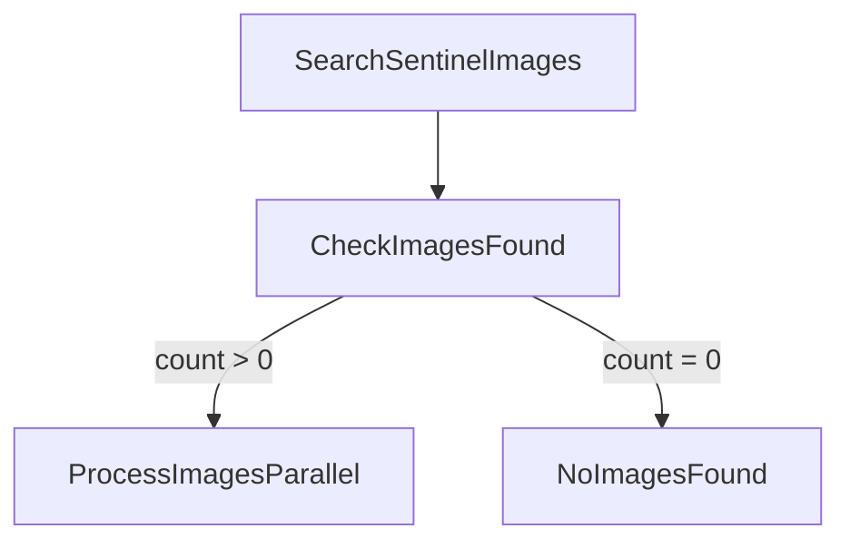
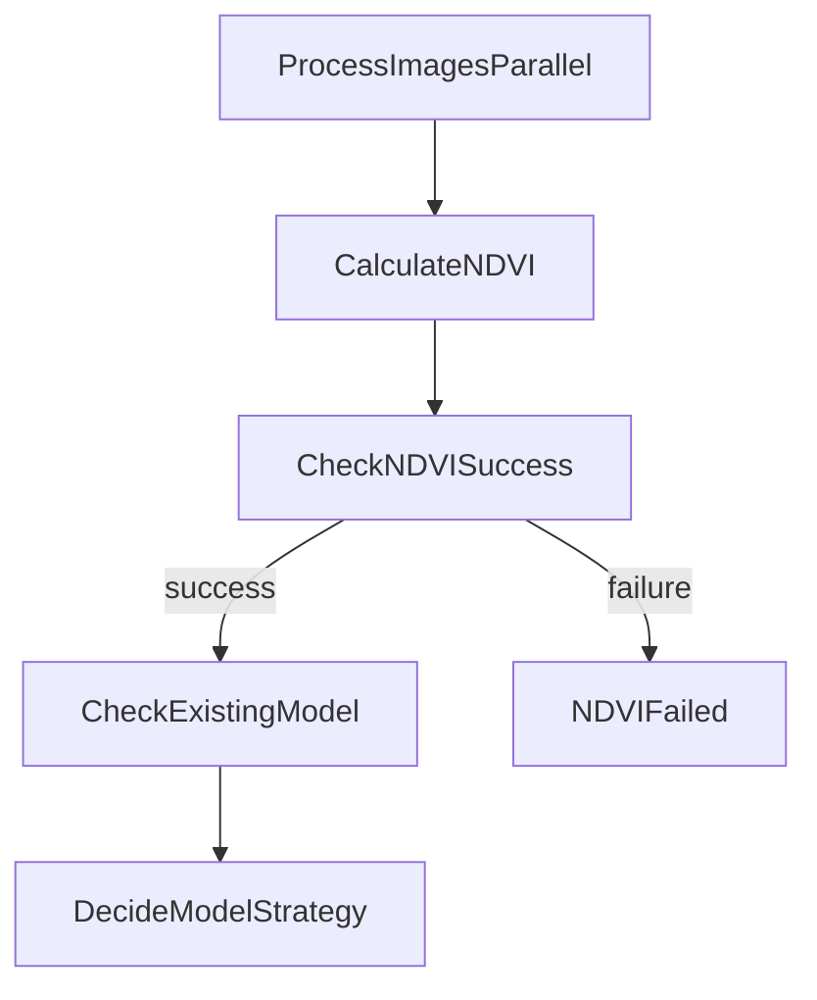
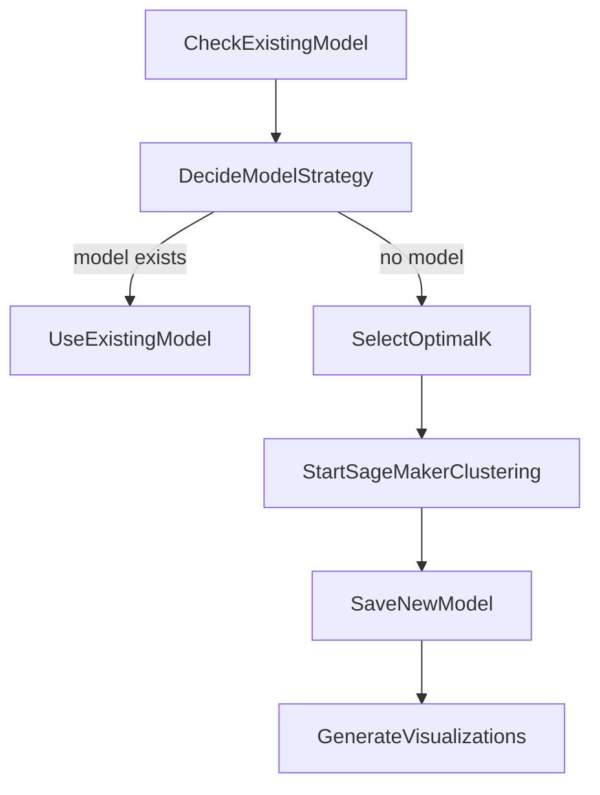
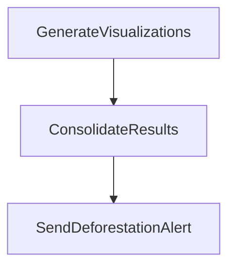
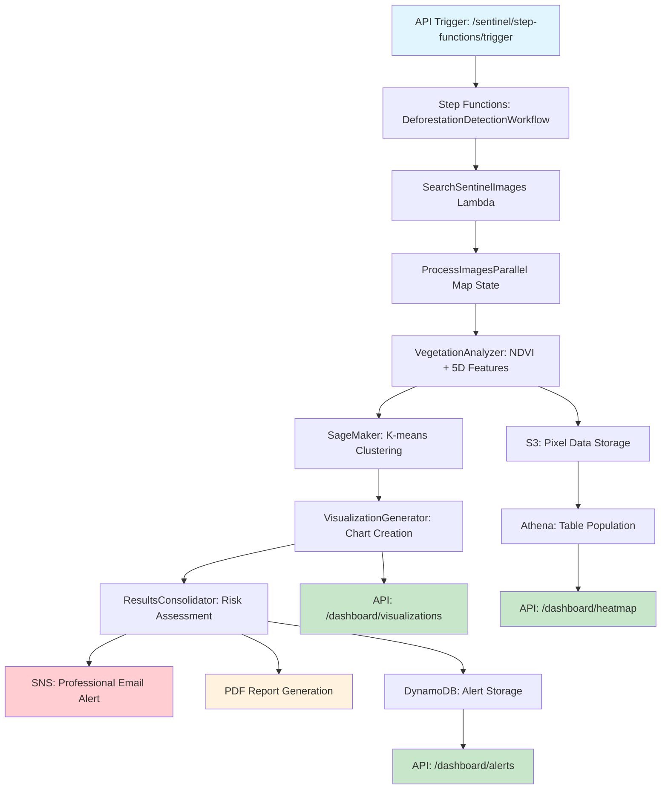

# ForestShield: Definitive Technical Specification & System Architecture
## Version 1.0
### Last Updated: 2023-10-27

---

## **TABLE OF CONTENTS**

1.  [**Introduction & Executive Summary**](#1-introduction--executive-summary)
    1.1. [System Purpose](#11-system-purpose)
    1.2. [Core Architectural Pillars](#12-core-architectural-pillars)
2.  [**Core Scientific & Mathematical Principles**](#2-core-scientific--mathematical-principles)
    2.1. [Normalized Difference Vegetation Index (NDVI)](#21-normalized-difference-vegetation-index-ndvi)
    2.2. [K-means Clustering for Land Cover Classification](#22-k-means-clustering-for-land-cover-classification)
    2.3. [Optimal Cluster Selection: The Elbow Method](#23-optimal-cluster-selection-the-elbow-method)
3.  [**Definitive Infrastructure Specification (`cloudformation.yaml`)**](#3-definitive-infrastructure-specification-cloudformationyaml)
    3.1. [Networking Layer (AWS VPC)](#31-networking-layer-aws-vpc)
    3.2. [Application & API Layer (AWS App Runner)](#32-application--api-layer-aws-app-runner)
    3.3. [Data & Analytics Layer](#33-data--analytics-layer)
    3.4. [Security & Permissions (AWS IAM)](#34-security--permissions-aws-iam)
4.  [**Application Logic & Workflow Internals (Source Code Analysis)**](#4-application-logic--workflow-internals-source-code-analysis)
    4.1. [Primary Workflow: `DeforestationDetectionWorkflow` Deep Dive](#41-primary-workflow-deforestationdetectionworkflow-deep-dive)
    4.2. [Lambda Function Internals & Algorithms](#42-lambda-function-internals--algorithms)
    4.3. [API Service Layer Logic (NestJS)](#43-api-service-layer-logic-nestjs)
5.  [**Data Models & Schemas**](#5-data-models--schemas)
    5.1. [S3 Data Lake Object Schemas](#51-s3-data-lake-object-schemas)
    5.2. [DynamoDB Table Schemas](#52-dynamodb-table-schemas)
6.  [**Data Visualization & Alert System Deep Dive**](#6-data-visualization--alert-system-deep-dive)
    6.1. [Heatmap System Architecture](#61-heatmap-system-architecture)
    6.2. [Alert System Architecture & Generation Logic](#62-alert-system-architecture--generation-logic)
7.  [**Complete Analysis Workflow (Step Functions Deep Dive)**](#7-complete-analysis-workflow-step-functions-deep-dive)
    7.1. [DeforestationDetectionWorkflow State Machine](#71-deforestationdetectionworkflow-state-machine)
    7.2. [Email & PDF Report Generation System](#72-email--pdf-report-generation-system)
8.  [**NDVI Processing & Satellite Image Analysis**](#8-ndvi-processing--satellite-image-analysis)
    8.1. [NDVI Scientific Foundation](#81-ndvi-scientific-foundation)
    8.2. [Sentinel-2 Image Processing Pipeline](#82-sentinel-2-image-processing-pipeline)
    8.3. [K-means Feature Engineering](#83-k-means-feature-engineering)
9.  [**Complete End-to-End Workflow Example**](#9-complete-end-to-end-workflow-example)
    9.1. [Amazon Rainforest Monitoring Scenario](#91-amazon-rainforest-monitoring-scenario)
    9.2. [Data Flow from Analysis to Visualization](#92-data-flow-from-analysis-to-visualization)
    9.3. [API Usage Examples](#93-api-usage-examples)

---

## **1. Introduction & Executive Summary**

### **1.1. System Purpose**

ForestShield is a fully serverless, cloud-native platform designed for the automated monitoring and analysis of deforestation using Sentinel-2 satellite imagery. It is architected around asynchronous, event-driven principles to create a scalable, resilient, and cost-effective system capable of processing large geospatial datasets. The entire infrastructure is defined declaratively using AWS CloudFormation, ensuring reproducibility and version control of the environment.

### **1.2. Core Architectural Pillars**

-   **Serverless First**: All components, from the API layer to the compute and orchestration engines, leverage managed AWS services (App Runner, Lambda, Step Functions). This design minimizes operational overhead associated with managing servers, patching, and scaling.
-   **API-Driven Orchestration**: A central NestJS application, hosted on AWS App Runner, serves as the primary control plane. It exposes a RESTful API for user interaction and is responsible for initiating backend workflows, but it delegates all long-running or computationally intensive tasks.
-   **Decoupled, Asynchronous Processing**: The core analysis pipeline is orchestrated by an AWS Step Functions state machine. This critically decouples the synchronous API from the long-running analysis process (which can take many minutes), ensuring the API remains responsive. The API initiates a workflow and can later query its status, a standard asynchronous backend processing pattern.
-   **Function-as-a-Service (FaaS) Compute**: All computational tasks are encapsulated within single-purpose AWS Lambda functions. This allows for the independent scaling, resource allocation (memory/timeout), and maintenance of each logical task in the pipeline.
-   **Region-Aware Machine Learning**: The system is designed to handle analyses across different global biomes. The workflow and data models are explicitly aware of the `region` and `tile_id` of the satellite imagery, ensuring that machine learning models are trained and applied only to their relevant geographical areas.

---

## **2. Core Scientific & Mathematical Principles**

### **2.1. Normalized Difference Vegetation Index (NDVI)**

The foundational metric for measuring vegetation health is the NDVI. It is calculated by the `vegetation-analyzer` Lambda function on a per-pixel basis using the reflectance values from the Red and Near-Infrared (NIR) spectral bands of the Sentinel-2 satellite.

The mathematical formula is:

\[ \text{NDVI} = \frac{(\text{NIR} - \text{Red})}{(\text{NIR} + \text{Red})} \]

-   **NIR**: Reflectance value from the Sentinel-2 B08 band.
-   **Red**: Reflectance value from the Sentinel-2 B04 band.

The resulting values range from **-1.0 to +1.0**. Higher positive values (typically > 0.2) indicate healthy, dense vegetation, as chlorophyll strongly reflects NIR light and absorbs red light. Values near zero or below indicate non-vegetated surfaces like soil, water, or impervious surfaces (roads, buildings).

### **2.2. K-means Clustering for Land Cover Classification**

The system employs K-means clustering within Amazon SageMaker as an unsupervised machine learning technique to segment the multi-dimensional pixel data into distinct land-cover classes. Each pixel is represented as a 5-dimensional vector: `[NDVI, Red, NIR, Latitude, Longitude]`. The algorithm groups these vectors into *K* clusters by minimizing the within-cluster sum of squares.

### **2.3. Optimal Cluster Selection: The Elbow Method**

A key challenge in K-means is choosing the optimal number of clusters, *K*. The `k-selector` Lambda function automates this by implementing the **Elbow Method**. This method involves running the K-means algorithm for a range of *K* values and calculating the Sum of Squared Errors (SSE) for each run.

The SSE is defined as:

\[ \text{SSE} = \sum_{i=1}^{k} \sum_{x \in C_i} \text{dist}(x, \mu_i)^2 \]

-   *k* is the number of clusters.
-   *C_i* is the *i*-th cluster.
-   *x* is a data point (a 5-D pixel vector) in cluster *C_i*.
-   *μ_i* is the centroid (mean vector) of cluster *C_i*.
-   `dist` is the Euclidean distance between the point and the centroid.

When the SSE is plotted against *K*, the plot typically shows a sharp decrease in SSE as *K* increases, followed by a flattening of the curve. The "elbow" of this curve represents the point of diminishing returns, where adding another cluster does not significantly reduce the SSE. The `k-selector` function programmatically identifies this point and selects it as the optimal *K*.

---

## **3. Definitive Infrastructure Specification (`cloudformation.yaml`)**

This section details every AWS resource provisioned by the CloudFormation template.

### **3.1. Networking Layer (AWS VPC)**

-   **`ForestShieldVPC` (`AWS::EC2::VPC`)**: The foundational network boundary with a CIDR block of `10.0.0.0/16`.
-   **Subnets & Routing**:
    -   **Public Subnets**: `PublicSubnet1` (`10.0.0.0/24`) and `PublicSubnet2` (`10.0.3.0/24`) are deployed across two Availability Zones for high availability. They are associated with the `PublicRouteTable`, which has a default route (`0.0.0.0/0`) pointed to the `InternetGateway`. This provides direct internet egress and allows them to host public-facing resources like NAT Gateways.
    -   **Private Subnets**: `PrivateSubnet1` (`10.0.1.0/24`) and `PrivateSubnet2` (`10.0.2.0/24`) are also deployed across two AZs. They use `PrivateRouteTable1` and `PrivateRouteTable2`, which route default traffic (`0.0.0.0/0`) to the NAT Gateways. This allows resources within them (like the Redis cluster) to initiate outbound connections (e.g., for security updates) without being publicly addressable.
-   **Gateways**:
    -   **`InternetGateway`**: The primary internet ingress/egress point for the VPC.
    -   **`NatGateway1` & `NatGateway2`**: Deployed in the public subnets and associated with Elastic IPs (`NatGatewayEIP1`, `NatGatewayEIP2`) to provide stable, managed network address translation for the private subnets.
-   **Security Groups**:
    -   **`AppRunnerSecurityGroup`**: Secures the App Runner service's VPC Connector. Its egress rules are critical:
        1.  Allows outbound TCP traffic on port `6379` exclusively to the `RedisSecurityGroup`.
        2.  Allows all other outbound traffic (`-1`) to `0.0.0.0/0` for accessing public AWS APIs (like S3, DynamoDB, Lambda).
    -   **`RedisSecurityGroup`**: A stateful firewall for the ElastiCache cluster. It has **no Egress rules** by default.
    -   **`AppRunnerToRedisIngressRule`**: A dedicated ingress rule on the `RedisSecurityGroup` that allows inbound TCP traffic on port `6379` *only* from the `AppRunnerSecurityGroup`. This creates a tightly controlled, unidirectional access path from the API layer to the cache, following the principle of least privilege.

### **3.2. Application & API Layer (AWS App Runner)**

-   **`APIService` (`AWS::AppRunner::Service`)**:
    -   **Source**: A Docker image identified by the URI `${AWS::AccountId}.dkr.ecr.${AWS::Region}.amazonaws.com/forestshield-api:latest`. The `AppRunnerECRAccessRole` grants App Runner permission to pull from this ECR repository.
    -   **Instance Configuration**: `Cpu: '1 vCPU'`, `Memory: '2 GB'`. The service runs under the identity of the `AppRunnerInstanceRole`.
    -   **Networking**: Egress is explicitly configured to be of type `VPC` and uses the `VpcConnector`. This is a critical security configuration that forces all outbound traffic from the API container through the VPC's defined routing and security rules.
    -   **Health Check**: Actively monitors the `/health` path on port `3000` of the container every 10 seconds.
-   **`AppRunnerAutoScaling`**: A dedicated auto-scaling configuration that allows the service to scale from a `MinSize: 1` to a `MaxSize: 10`, with each instance handling up to `MaxConcurrency: 100` requests.

### **3.3. Data & Analytics Layer**

-   **S3 Buckets**:
    -   **`ProcessedDataBucket`**: Versioning is `Enabled` to protect against accidental overwrites and to maintain a history of processed data artifacts. This is the primary data lake.
    -   **`ModelsBucket`**: Versioning is `Enabled` to maintain a full history of all trained machine learning models.
    -   **`TempBucket`**: A `LifecycleConfiguration` rule automatically purges objects older than 7 days to manage costs.
-   **DynamoDB Tables**:
    -   **Billing Mode**: Both tables use `PROVISIONED` throughput with 5 WCUs and 5 RCUs, indicating a predictable and moderate workload.
    -   **`MonitoredRegionsTable`**: A simple key-value store with `regionId` (String) as the HASH key.
    -   **`DeforestationAlertsTable`**: Features a **Global Secondary Index (GSI)** named `RegionIdIndex` on the `regionId` attribute. This GSI is essential for efficiently querying the alert history for a specific monitored region, a core feature of the dashboard. Without it, the application would have to perform a costly full-table `Scan` operation.
-   **ElastiCache for Redis**:
    -   **`RedisCluster` (`AWS::ElastiCache::ReplicationGroup`)**: A `cache.t3.micro` Redis 7.0 cluster with `NumCacheClusters: 2`.
    -   **High Availability**: `MultiAZEnabled` and `AutomaticFailoverEnabled` are both `true`. This creates a primary and replica node in different AZs. If the primary node fails, ElastiCache will automatically promote the replica to primary, providing resilience.
    -   **Security**: `AtRestEncryptionEnabled` and `TransitEncryptionEnabled` are both `true`, ensuring data is encrypted both on disk and in transit.
-   **Glue & Athena**:
    -   **`GeospatialDataTable`**: An external table defined with a `StorageDescriptor` that uses `org.openx.data.jsonserde.JsonSerDe` to parse the JSON-formatted pixel data files stored in S3. It is partitioned by `year`, `month`, and `day`, which dramatically improves query performance and reduces cost by allowing Athena to prune partitions and avoid scanning irrelevant data.
    -   **`GeospatialDataCrawler`**: A scheduled crawler (`cron(0 1 * * ? *)`) that automatically discovers new data partitions in S3.
    -   **`CrawlerStartFunction` (`AWS::CloudFormation::CustomResource`)**: A Lambda-backed custom resource that programmatically triggers the `GeospatialDataCrawler` upon stack creation or update. This ensures the Athena table is immediately populated and queryable after deployment without manual intervention.

### **3.4. Security & Permissions (AWS IAM)**

-   **`LambdaExecutionRole`**: Assumed by Lambda and SageMaker. Contains managed policies for basic execution, S3 full access, and SageMaker full access. Critically, its inline policy grants `iam:PassRole` on the `SageMakerExecutionRole`, allowing a Lambda function to grant SageMaker permission to act on its behalf.
-   **`SageMakerExecutionRole`**: Assumed by the SageMaker service. Grants the training jobs permission to read from the `processed-data` bucket and write to the `models` bucket.
-   **`StepFunctionsExecutionRole`**: Assumed by Step Functions. A powerful role that allows the state machine to invoke Lambda functions (`lambda:InvokeFunction`), publish to SNS, and start SageMaker jobs. It also has `iam:PassRole` on the `SageMakerExecutionRole`.
-   **`AppRunnerInstanceRole`**: Assumed by the App Runner tasks. The inline `ForestShieldAPIAccess` policy grants specific permissions to other AWS services, such as `lambda:InvokeFunction`, `states:StartExecution`, `dynamodb:Query`, `athena:StartQueryExecution`, etc.
-   **`AppRunnerECRAccessRole`**: Assumed by the App Runner **Build Service** (`build.apprunner.amazonaws.com`), *not* the running tasks. It allows the App Runner service itself to pull the container image from ECR during deployment.

---

## **4. Application Logic & Workflow Internals (Source Code Analysis)**

### **4.1. Primary Workflow: `DeforestationDetectionWorkflow` Deep Dive**

This is a state-by-state analysis of the workflow's logic and data transformations.

| State Name | Resource Invoked | Input Payload (from previous state) | Core Logic | Output Payload (to next state) | Error Handling |
| :--- | :--- | :--- | :--- | :--- | :--- |
| `SearchSentinelImages` | `SearchImagesHandler` | `{ "latitude": -6.0, ... }` | Invokes the Java Lambda to construct and execute a detailed STAC API query. | `Payload: { "count": 22, "images": [...] }` | `Retry` on `States.TaskFailed`. |
| `ProcessImagesParallel`| Map State | `$.Payload` | Iterates over the `$.images` array. Each parallel execution receives one element from the array. | An array of the final outputs from each parallel branch. | N/A |
| `CalculateNDVI` | `vegetation-analyzer` | `{ "id": "S2B_...", "assets": { "B04": "...", "B08": "..." } }` | The Python Lambda uses `rasterio` to open the band URLs, calculates NDVI, computes statistics, uploads a 5-D pixel vector JSON to S3, and returns the S3 path. | `{ "success": true, "statistics": {...}, "sagemaker_training_data": "s3://..." }` | `Retry` on `States.TaskFailed`. |
| `CheckExistingModel` | `model-manager` | `{ "imageId": "...", "region": "..." }` | Invokes the model manager in `get-latest-model` mode to check for a pre-existing model artifact in S3 based on both `tile_id` and `region`. | `{ "model_exists": true/false, "model_s3_path": "..." }` | `Retry` on `States.TaskFailed`. |
| `DecideModelStrategy`| Choice Rule | `$.existing_model` | A simple router. Checks the boolean variable `$.existing_model.model_exists`. | The original payload is passed through. | N/A |
| `SelectOptimalK` | `k-selector` | `$.sagemaker_training_data` | The Python Lambda starts multiple parallel SageMaker jobs to find the "elbow point" of the SSE curve. | `{ "optimal_k": 4, "confidence_score": 0.95 }` | **`Catch` block for `States.ALL`**. On any failure, it goes to `StartSageMakerClustering` and passes a default `optimal_k`. This makes the pipeline resilient. |
| `StartSageMakerClustering`| `sagemaker:createTrainingJob.sync`| `$.k_selection_result.optimal_k` | Initiates the main K-means training job, passing the optimal K as a hyperparameter. The `.sync` pattern pauses the workflow. | The full `DescribeTrainingJob` API response from SageMaker. | `Retry` on `SageMaker.AmazonSageMakerException`. `Catch` block for `States.ALL` routes to a `SageMakerFailed` state. |
| `ConsolidateResults` | `results-consolidator` | The array output from the `ProcessImagesParallel` map state. | Aggregates stats, calculates confidence scores, generates a PDF report using `reportlab`, uploads it to S3, and formats the final email content. | `{ "workflow_status": "COMPLETED", "email_content": { "subject": "...", "message": "..." } }` | `Retry` on `States.TaskFailed`. |
| `SendDeforestationAlert`| `sns:publish` | `$.email_content` | Publishes the subject (`$.email_content.subject`) and message (`$.email_content.message`) to the `AlertsTopic`. | N/A | N/A |

### **4.2. Lambda Function Internals & Algorithms**

#### **`vegetation-analyzer` (`handler.py`)**

-   **Purpose**: Core scientific data processing engine.
-   **Algorithm**:
    1.  Receives S3 URLs for Red (B04) and NIR (B08) bands.
    2.  Uses `rasterio` to open these URLs directly in memory.
    3.  Performs NumPy array arithmetic to calculate the NDVI map.
    4.  Generates statistics (mean, min, max, std dev) from the NDVI array.
    5.  Constructs a 5-dimensional data structure for every pixel: `[NDVI, Red, NIR, Latitude, Longitude]`.
    6.  Uploads this comprehensive pixel data as a single JSON file to S3 for SageMaker.
-   **Key Libraries**: `rasterio`, `numpy`, `boto3`.
-   **Invocation Handling**: Detects invocation source (API Gateway vs. Step Functions) by checking for `event['body']`. For Step Functions, it omits the large pixel data array from its return payload to avoid exceeding the 256KB state transition limit, returning only the S3 path.

#### **`k-selector` (`handler.py`)**

-   **Purpose**: Automates hyperparameter tuning for K-means.
-   **Algorithm**: Implements the "Elbow Method".
    1.  Defines a static list of K values to test (e.g., `k_values = [2, 3, 4, 5, 6]`).
    2.  For each `k`, it calls `sagemaker_client.create_training_job()` to start a new training job in parallel.
    3.  It enters a `while` loop, polling `sagemaker_client.describe_training_job()` for each job.
    4.  It extracts the final `sse` (Sum of Squared Errors) metric from the logs of each completed job.
    5.  It programmatically finds the "elbow" of the SSE vs. K curve to determine the optimal K.
-   **Key Libraries**: `boto3`, `numpy`.

#### **`results-consolidator` (`handler.py`)**

-   **Purpose**: The final reporting and analytics engine.
-   **Algorithm**:
    1.  Receives an array of results from the parallel processing stage.
    2.  Calculates aggregate statistics (e.g., average vegetation coverage).
    3.  Performs a sophisticated risk assessment by analyzing model usage and cluster changes.
    4.  Calculates multiple confidence scores to assess the reliability of the analysis.
    5.  Uses the `reportlab` library to programmatically generate a multi-page PDF report with tables and statistics.
    6.  Uploads the generated PDF to S3.
    7.  Formats the final email subject and body for the SNS notification, including a pre-signed link to the PDF.
    8.  Makes an asynchronous, "fire-and-forget" call (`InvocationType='Event'`) to the `model-manager` to trigger performance metric tracking.
-   **Key Libraries**: `reportlab`, `boto3`, `statistics`.

#### **`SearchImagesHandler.java`**

-   **Purpose**: Data acquisition client for the external STAC API.
-   **Logic**:
    1.  Constructs a detailed JSON search payload for the `earth-search.aws.element84.com/v1/search` endpoint.
    2.  The payload specifies the `sentinel-2-l2a` collection and uses the `fields` parameter to request *only* the specific asset URLs and properties (`B04`, `B08`, `id`, etc.) needed downstream. This is a critical network optimization.
    3.  Uses Java's native `HttpClient` to make the POST request.
    4.  Uses the `com.fasterxml.jackson.databind.ObjectMapper` to parse the JSON response and map it to `SentinelImage` Java objects.
-   **Performance Optimizations**: Implements the `org.crac.Resource` interface to leverage AWS Lambda SnapStart, minimizing cold start latency for this Java function.

### **4.3. API Service Layer Logic (NestJS)**

-   **`SentinelDataService`**: Acts as a client and orchestrator. Its `searchImages()` method invokes the `search-images` Lambda and maps the raw STAC feature response into the application's internal `SentinelImage` data model. Its `calculateNDVIWithLambda()` method prepares the payload and invokes the `vegetation-analyzer`, understanding its specific input/output contract.
-   **`DashboardService`**: Manages application state. It performs CRUD operations against the DynamoDB tables and handles user subscriptions by directly interacting with the AWS SNS API.

---

## **5. Data Models & Schemas**

### **5.1. S3 Data Lake Object Schemas**

-   **Raw Pixel Data for Training (`geospatial-data/`)**:
    -   A single JSON file per analysis, containing an array of pixel vectors.
    -   **Pixel Vector Format**: `[<ndvi_float>, <red_int>, <nir_int>, <latitude_double>, <longitude_double>]`. This 5-dimensional vector is the direct input for the `feature_dim: "5"` hyperparameter in the SageMaker K-means job.
-   **ML Model Artifacts (`sagemaker-models/`)**:
    -   **`model.tar.gz`**: The binary model artifact from SageMaker.
    -   **`metadata.json`**: A JSON file created by the `model-manager` to track model provenance.
        ```json
        {
          "tile_id": "S2B_...",
          "region": "aws-eu-central-1",
          "model_version": "20231027-123456",
          "model_s3_path": "s3://...",
          "source_training_job": "k-selection-...",
          "creation_timestamp_utc": "..."
        }
        ```

### **5.2. DynamoDB Table Schemas**

-   **`MonitoredRegionsTable`**:
    -   **Purpose**: Stores user-defined regions to monitor.
    -   **Example Item**:
        ```json
        {
          "regionId": { "S": "a1b2c3d4-e5f6-7890-1234-567890abcdef" },
          "name": { "S": "Amazon Rainforest - Sector A" },
          "latitude": { "N": "-6.0" },
          "longitude": { "N": "-53.0" },
          "radiusKm": { "N": "10" },
          "status": { "S": "ACTIVE" },
          "createdAt": { "S": "2024-01-01T00:00:00Z" }
        }
        ```
-   **`DeforestationAlertsTable`**:
    -   **Purpose**: A log of all triggered deforestation alerts.
    -   **Example Item**:
        ```json
        {
          "alertId": { "S": "f0e9d8c7-b6a5-4321-fedc-ba9876543210" },
          "regionId": { "S": "a1b2c3d4-e5f6-7890-1234-567890abcdef" },
          "regionName": { "S": "Amazon Rainforest - Sector A" },
          "level": { "S": "HIGH" },
          "deforestationPercentage": { "N": "15.2" },
          "timestamp": { "S": "2024-01-15T10:30:00Z" },
          "acknowledged": { "BOOL": false }
        }
        ```

---

## **6. Data Visualization & Alert System Deep Dive**

### **6.1. Heatmap System Architecture**

**What are Heatmaps in ForestShield?**

Heatmaps in ForestShield are geographic visualizations that display deforestation intensity across monitored regions using color gradients. They provide a visual representation of vegetation health and changes over time.

**Technical Implementation:**
- **Data Source**: Athena queries against the `geospatial_data` table stored in S3
- **Query Engine**: AWS Athena with partition pruning for performance
- **Geographic Format**: WGS 84 coordinate system (EPSG:4326)
- **Data Structure**: Each heatmap point contains:
  ```typescript
  {
    latitude: number,    // WGS 84 coordinate
    longitude: number,   // WGS 84 coordinate 
    intensity: number,   // NDVI value (-1.0 to +1.0)
    cellSize: number     // Grid cell size in meters (default: 1000m)
  }
  ```

**API Implementation:**
- **Endpoint**: `GET /dashboard/heatmap`
- **Query Parameters**: `north`, `south`, `east`, `west` (bounding box), `days` (time period)
- **Performance**: Limited to 10,000 points per query for optimal rendering
- **Caching**: Results cached in Redis for 1 hour

**Athena Query Structure:**
```sql
SELECT latitude, longitude, ndvi
FROM "forestshield_database"."geospatial_data"
WHERE date_parse(substr(timestamp, 1, 10), '%Y-%m-%d') >= date('${startDate}')
  AND latitude BETWEEN ${south} AND ${north}
  AND longitude BETWEEN ${west} AND ${east}
LIMIT 10000;
```

### **6.2. Alert System Architecture & Generation Logic**

**What are Alerts?**

Alerts are automated notifications triggered when the intelligent analysis system detects potential deforestation or vegetation changes in monitored regions.

**Alert Levels & Thresholds:**
- **HIGH**: `deforestationPercentage > 10%` - Significant vegetation loss detected
- **MODERATE**: `deforestationPercentage > 5%` - Moderate vegetation loss  
- **LOW**: `deforestationPercentage > 3%` - Minor vegetation change
- **INFO**: Stable conditions or data reporting

**Alert Generation Workflow:**
1. **Trigger Points**: 
   - Step Functions workflow completion
   - Real-time region analysis via `/sentinel/analyze-region`
   - Scheduled monitoring jobs

2. **Intelligence-Based Assessment**: The system uses ML model comparison rather than simple thresholds:
   ```python
   def assess_deforestation_risk(statistics, processing_results):
       # Analyze model usage patterns
       model_analysis = analyze_model_usage(processing_results)
       
       # Perform cluster-based change detection  
       change_detection = perform_cluster_change_detection(processing_results)
       
       # Determine risk using ML insights vs simple thresholds
       risk_level = determine_intelligent_risk_level(
           model_analysis, change_detection, statistics
       )
   ```

3. **Confidence Scoring**: Each alert includes confidence metrics:
   - **Spatial Coherence**: Geographic consistency of detected changes
   - **Temporal Accuracy**: Time-based validation of patterns
   - **Model Agreement**: Consensus between different ML approaches
   - **Data Quality**: Percentage of valid satellite pixels analyzed

**Alert Storage & Management:**
- **Database**: DynamoDB table `forestshield-deforestation-alerts-db`
- **Schema**: 
  ```json
  {
    "alertId": "string",
    "regionId": "string", 
    "regionName": "string",
    "level": "HIGH|MODERATE|LOW|INFO",
    "deforestationPercentage": "number",
    "timestamp": "ISO8601",
    "acknowledged": "boolean"
  }
  ```
- **Indexing**: Global Secondary Index on `regionId` for efficient querying

**Notification Delivery:**
- **SNS Topic**: `forestshield-deforestation-alerts`
- **Email Format**: Professional email with PDF report attachment
- **Dashboard**: Real-time alert management interface

---

## **7. Complete Analysis Workflow (Step Functions Deep Dive)**

### **7.1. DeforestationDetectionWorkflow State Machine**

**Workflow Purpose**: End-to-end serverless pipeline for processing satellite imagery, performing ML analysis, and generating intelligent alerts.

**State-by-State Execution Flow:**

#### **Phase 1: Image Discovery**


1. **SearchSentinelImages** (Java Lambda):
   - Queries STAC API at `earth-search.aws.element84.com/v1/search`
   - Filters by date range, cloud cover, and geographic bounds
   - Optimizes request using `fields` parameter for specific assets (B04, B08)
   - Returns structured image metadata

#### **Phase 2: Parallel Image Processing**


2. **ProcessImagesParallel** (Map State):
   - **Concurrency**: Maximum 5 images processed simultaneously
   - **Iterator Logic**: Each image processed through identical sub-workflow
   - **Error Handling**: Individual image failures don't stop overall workflow

3. **CalculateNDVI** (Python Lambda - `vegetation-analyzer`):
   - **Scientific Core**: Implements `NDVI = (NIR - Red) / (NIR + Red)` formula
   - **Real Pixel Extraction**: Generates 5D feature vectors `[NDVI, Red, NIR, Latitude, Longitude]`
   - **Chunked Processing**: Processes 1024x1024 pixel chunks for memory efficiency
   - **Data Output**: Creates S3-stored JSON files for SageMaker input

#### **Phase 3: Machine Learning Pipeline**


4. **Model Intelligence System**:
   - **Model Manager**: Checks for existing models by `tile_id` and `region`
   - **K-Selector**: Implements Elbow Method for optimal cluster selection:
     ```python
     # Test K values [2,3,4,5,6] in parallel SageMaker jobs
     sse_scores = []
     for k in k_values:
         job_result = sagemaker_client.create_training_job(k=k)
         sse_scores.append(extract_sse_from_logs(job_result))
     
     optimal_k = find_elbow_point(sse_scores)
     ```

5. **SageMaker K-means Clustering**:
   - **Algorithm**: `174872318107.dkr.ecr.us-west-2.amazonaws.com/kmeans:1`
   - **Instance**: `ml.m5.large` with 10GB storage
   - **Input Format**: 5-dimensional pixel vectors in CSV format
   - **Sync Execution**: Step Functions waits for training completion

#### **Phase 4: Results & Visualization**


6. **Visualization Generator** (Python Lambda):
   - **Plot Types**: 
     - NDVI vs Red Band scatter plots with cluster colors
     - Geographic distribution maps
     - Feature distribution histograms
     - Cluster statistics and centroids
     - NDVI vs NIR analysis
   - **Storage**: High-resolution PNG files saved to S3
   - **Access**: Signed URLs generated via `/dashboard/visualizations` API

### **7.2. Email & PDF Report Generation System**

**Results Consolidator Lambda** (`results-consolidator`):

The final stage generates comprehensive PDF reports and professional email notifications using the `reportlab` library.

**PDF Report Structure:**
```python
def generate_detailed_pdf_report():
    # Executive Summary Table
    summary_data = [
        ['Alert Level', risk_level],
        ['Confidence', f"{confidence_level} ({overall_confidence:.1%})"],
        ['Data Quality', f"{data_quality:.1f}% valid pixels"]
    ]
    
    # Vegetation Analysis Section
    vegetation_data = [
        ['Average Vegetation Coverage', f"{avg_coverage:.1f}%"],
        ['NDVI Range', f"{min_ndvi:.3f} - {max_ndvi:.3f}"],
        ['Total Pixels Analyzed', f"{total_pixels:,}"]
    ]
    
    # Technical Details & Visualization Links
    tech_details = [
        "• Satellite Data Source: Sentinel-2",
        "• Analysis Method: K-means clustering with 5D features",
        "• NDVI Calculation: (NIR - Red) / (NIR + Red)",
        "• Machine Learning: Intelligent model reuse and comparison"
    ]
```

**Email Generation:**
- **Subject Format**: `🚨 URGENT|⚠️ WARNING|ℹ️ INFO: {description} - ForestShield Alert`
- **Content Structure**:
  - Risk level and confidence summary
  - Key vegetation metrics
  - PDF download link (7-day expiration)
  - Dashboard management links
  - Unsubscribe options

**S3 Storage & Access:**
- **PDF Path**: `s3://processed-data-bucket/reports/{timestamp}/ForestShield_Report_{risk_level}_{timestamp}.pdf`
- **Pre-signed URLs**: 7-day expiration for secure access
- **Metadata**: Risk level, generation timestamp, system identification

---

## **8. NDVI Processing & Satellite Image Analysis**

### **8.1. NDVI Scientific Foundation**

**Mathematical Formula:**
```
NDVI = (NIR - Red) / (NIR + Red)
```

**Where:**
- **NIR**: Near-Infrared reflectance (Sentinel-2 Band B08, 842nm wavelength)
- **Red**: Red light reflectance (Sentinel-2 Band B04, 665nm wavelength)
- **Range**: -1.0 to +1.0 (typical vegetation > 0.2)

**Physical Interpretation:**
- **High NDVI (0.6-1.0)**: Dense, healthy vegetation (high chlorophyll content)
- **Moderate NDVI (0.2-0.6)**: Sparse vegetation or stressed plants
- **Low NDVI (0.0-0.2)**: Bare soil, urban areas, rock surfaces
- **Negative NDVI**: Water bodies, snow, clouds

### **8.2. Sentinel-2 Image Processing Pipeline**

**Image Acquisition:**
- **Source**: Sentinel-2 Level-2A (atmospherically corrected)
- **Access**: STAC API via `earth-search.aws.element84.com`
- **Bands Used**: B04 (Red, 10m resolution), B08 (NIR, 10m resolution)
- **Format**: Cloud Optimized GeoTIFF (COG) or JPEG2000

**Technical Processing Chain:**
```python
def calculate_ndvi_from_urls(red_url, nir_url, image_id):
    # 1. Direct cloud access via rasterio
    with rasterio.open(red_url) as red_src:
        with rasterio.open(nir_url) as nir_src:
            
            # 2. Chunked processing for memory efficiency
            for chunk_row in range(0, height, chunk_size):
                red_chunk = red_src.read(1, window=Window(...))
                nir_chunk = nir_src.read(1, window=Window(...))
                
                # 3. NDVI calculation with safe division
                ndvi_chunk = (nir_chunk - red_chunk) / (nir_chunk + red_chunk)
                
                # 4. Extract 5D pixel vectors
                for pixel in valid_pixels:
                    pixel_features = [
                        ndvi_val,     # Vegetation index
                        red_val,      # Red reflectance
                        nir_val,      # NIR reflectance
                        latitude,     # Geographic coordinate
                        longitude     # Geographic coordinate  
                    ]
```

**Spatial Coordinate Transformation:**
```python
# Convert pixel coordinates to geographic coordinates
transformer = Transformer.from_crs(source_crs, "EPSG:4326")
x, y = xy(transform, pixel_row, pixel_col)
longitude, latitude = transformer.transform(x, y)
```

**Data Quality & Validation:**
- **Cloud Masking**: Automatic detection and removal of cloudy pixels
- **No-Data Handling**: Sentinel-2 uses 0 values to indicate no data
- **Coordinate Validation**: Ensures coordinates fall within valid Earth bounds
- **Statistical Validation**: NDVI values constrained to [-1, +1] range

### **8.3. K-means Feature Engineering**

**5-Dimensional Feature Space:**
The system creates rich feature vectors combining spectral and spatial information:

```python
pixel_features = [
    ndvi_value,      # Primary vegetation indicator
    red_reflectance, # Soil/urban signature  
    nir_reflectance, # Vegetation vigor
    latitude,        # Geographic context
    longitude        # Geographic context
]
```

**Clustering Advantages:**
- **Beyond Thresholds**: ML clustering captures complex land-cover patterns
- **Spatial Awareness**: Geographic coordinates enable region-specific models
- **Multi-spectral**: Uses full spectral signature, not just NDVI
- **Adaptive**: Model reuse system adapts to different biomes and seasons

**Performance Optimization:**
- **Sampling Strategy**: Intelligent sampling (max 25,000 pixels per image)
- **Chunk Processing**: 1024x1024 pixel chunks for memory management
- **Priority Areas**: Vegetation-rich regions processed first
- **Model Caching**: Trained models reused across similar geographic tiles

---

## **9. Complete End-to-End Workflow Example**

This section demonstrates a complete real-world workflow showing how ForestShield processes satellite data, generates alerts, and populates heatmaps using an Amazon Rainforest monitoring scenario.

### **9.1. Amazon Rainforest Monitoring Scenario**

**Objective**: Monitor a 20km x 20km section of the Amazon rainforest for deforestation changes over a 15-day period.

**Geographic Target**: 
- **Center Point**: Latitude -6.0, Longitude -53.0 (Pará State, Brazil)
- **Time Period**: January 1-15, 2024
- **Cloud Coverage**: Maximum 20% for clear imagery

#### **Step 1: Trigger Analysis via Step Functions**

```bash
curl -X POST https://api.forestshieldapp.com/sentinel/step-functions/trigger \
-H "Content-Type: application/json" \
-d '{
  "searchParams": {
    "latitude": -6.0,
    "longitude": -53.0,
    "startDate": "2024-01-01",
    "endDate": "2024-01-15",
    "cloudCover": 20
  },
  "maxImages": 3
}'
```

**API Response:**
```json
{
  "success": true,
  "executionArn": "arn:aws:states:us-west-2:123456789:execution:forestshield-pipeline:amazon-analysis-20240115",
  "message": "Step Functions workflow started"
}
```

#### **Step 2: Automated Workflow Execution**

The Step Functions workflow automatically processes through these phases:

**Phase 1: Image Discovery**
```json
{
  "count": 3,
  "images": [
    {
      "id": "S2B_MSIL2A_20240102T140059_N0510_R110_T20LPM_20240102T181805",
      "date": "2024-01-02T14:00:59Z",
      "assets": {
        "B04": "https://sentinel-s2-l2a.s3.amazonaws.com/.../B04.jp2",
        "B08": "https://sentinel-s2-l2a.s3.amazonaws.com/.../B08.jp2"
      },
      "cloudCover": 8.2
    }
    // ... 2 additional images
  ]
}
```

**Phase 2: NDVI Processing & Feature Extraction**
```python
# For each image, the vegetation-analyzer generates:
pixel_data_sample = [
    # [NDVI, Red, NIR, Latitude, Longitude]
    [0.847, 1842, 3456, -6.001234, -52.998765],  # Dense rainforest
    [0.234, 2156, 2891, -6.002341, -52.997654],  # Degraded area
    [0.156, 2876, 3123, -6.003456, -52.996543],  # Recently cleared
    [0.091, 3245, 3387, -6.004567, -52.995432],  # Bare soil/roads
    # ... up to 25,000 pixels per image
]

# Statistical summary generated:
statistics = {
    "mean_ndvi": 0.542,
    "vegetation_coverage": 67.3,  # 67.3% vegetation coverage
    "valid_pixels": 73420,
    "total_pixels": 77500,
    "data_quality_percentage": 94.7
}
```

**Phase 3: K-means Clustering Analysis**
```python
# SageMaker identifies 4 optimal clusters:
cluster_results = {
    "optimal_k": 4,
    "clusters": {
        0: {"centroid_ndvi": 0.841, "description": "Dense rainforest", "pixels": 32150},
        1: {"centroid_ndvi": 0.487, "description": "Secondary forest", "pixels": 18790},
        2: {"centroid_ndvi": 0.241, "description": "Degraded vegetation", "pixels": 14230},
        3: {"centroid_ndvi": 0.098, "description": "Deforested/bare", "pixels": 8250}
    }
}
```

**Phase 4: Risk Assessment & Alert Generation**
```python
# Intelligent analysis results:
risk_assessment = {
    "level": "HIGH",
    "priority": "CHANGE_DETECTED", 
    "description": "Significant vegetation changes detected through cluster analysis",
    "deforestation_percentage": 12.4,  # 12.4% vegetation loss
    "confidence_score": 0.873,
    "action_required": "Immediate investigation of detected changes recommended"
}
```

### **9.2. Data Flow from Analysis to Visualization**

#### **S3 Data Lake Population**

After analysis completion, data is stored across multiple S3 locations:

```
s3://forestshield-processed-data-381492060635/
├── geospatial-data/
│   ├── year=2024/month=01/day=15/
│   │   └── amazon_analysis_pixels_20240115_140523.json
│   └── [Athena partitioned structure]
├── visualizations/
│   ├── S2B/20240115_140523/
│   │   ├── ndvi_red_clusters.png
│   │   ├── geographic_distribution.png
│   │   ├── feature_distributions.png
│   │   ├── cluster_statistics.png
│   │   └── ndvi_nir_clusters.png
├── sagemaker-models/
│   ├── kmeans-s2b-20240115-140523/
│   │   ├── model.tar.gz
│   │   └── metadata.json
└── reports/
    └── 20240115_140523/
        └── ForestShield_Report_HIGH_20240115_140523.pdf
```

#### **Pixel Data Format for Heatmaps**

```json
{
  "pixel_records": [
    {
      "timestamp": "2024-01-15T14:05:23Z",
      "latitude": -6.001234,
      "longitude": -52.998765,
      "ndvi": 0.847,
      "red_reflectance": 1842,
      "nir_reflectance": 3456,
      "cluster_id": 0,
      "tile_id": "S2B_MSIL2A_20240102T140059",
      "region": "amazon_rainforest",
      "vegetation_class": "dense_forest"
    },
    {
      "timestamp": "2024-01-15T14:05:23Z", 
      "latitude": -6.003456,
      "longitude": -52.996543,
      "ndvi": 0.156,
      "red_reflectance": 2876,
      "nir_reflectance": 3123,
      "cluster_id": 2,
      "tile_id": "S2B_MSIL2A_20240102T140059",
      "region": "amazon_rainforest", 
      "vegetation_class": "deforested"
    }
    // ... thousands more pixel records
  ]
}
```

#### **Alert Creation & Notification**

**DynamoDB Alert Record:**
```json
{
  "alertId": "alert-f8e7d6c5-b4a3-2109-8765-4321fedcba98",
  "regionId": "amazon-sector-a",
  "regionName": "Amazon Rainforest - Sector A", 
  "level": "HIGH",
  "deforestationPercentage": 12.4,
  "message": "🚨 HIGH DEFORESTATION: 12.4% vegetation loss detected in Amazon Rainforest - Sector A",
  "timestamp": "2024-01-15T14:08:45Z",
  "acknowledged": false
}
```

**Professional Email Alert:**
```
Subject: 🚨 URGENT: Significant vegetation changes detected through cluster analysis - ForestShield Alert

🛡️ ForestShield Forest Monitoring Alert

🎯 ALERT LEVEL: HIGH
🔍 STATUS: Significant vegetation changes detected through cluster analysis
🎯 CONFIDENCE: HIGH (87.3%)

📊 QUICK SUMMARY:
• Images Analyzed: 3/3
• Average Vegetation Coverage: 67.3%
• Average NDVI: 0.542
• Data Quality: 94.7% valid pixels

💡 RECOMMENDED ACTION: Immediate investigation of detected changes recommended

📄 DETAILED ANALYSIS:
A comprehensive PDF report with complete analysis details is available:
📥 Download Report: https://s3-presigned-url.../ForestShield_Report_HIGH_20240115.pdf
⏰ Link expires: 7 days from analysis

📧 MANAGE ALERTS:
• Dashboard: https://api.forestshieldapp.com/dashboard/alerts
• Unsubscribe: https://api.forestshieldapp.com/dashboard/alerts/unsubscribe
```

### **9.3. API Usage Examples**

#### **Accessing Heatmap Data**

After analysis completion, retrieve heatmap visualization data:

```bash
# Get heatmap data for the analyzed Amazon region
curl "https://api.forestshieldapp.com/dashboard/heatmap?north=-5.9&south=-6.1&east=-52.9&west=-53.1&days=30" \
-H "Accept: application/json"
```

**Heatmap API Response:**
```json
{
  "data": [
    {
      "lat": -6.001234,
      "lng": -52.998765,
      "intensity": 0.847,    // High NDVI = dense forest (dark green on heatmap)
      "cellSize": 1000
    },
    {
      "lat": -6.002341,
      "lng": -52.997654, 
      "intensity": 0.487,    // Moderate NDVI = secondary forest (light green)
      "cellSize": 1000
    },
    {
      "lat": -6.003456,
      "lng": -52.996543,
      "intensity": 0.156,    // Low NDVI = deforested area (red on heatmap)
      "cellSize": 1000
    },
    {
      "lat": -6.004567,
      "lng": -52.995432,
      "intensity": 0.091,    // Very low NDVI = bare soil (dark red)
      "cellSize": 1000
    }
    // ... up to 10,000 points for optimal map rendering
  ],
  "bounds": {
    "north": -5.9,
    "south": -6.1,
    "east": -52.9, 
    "west": -53.1
  },
  "generatedAt": "2024-01-15T14:15:23Z",
  "periodDays": 30
}
```

#### **Retrieving Generated Visualizations**

Access the K-means clustering visualizations:

```bash
# Get NDVI vs Red band scatter plot with cluster colors
curl "https://api.forestshieldapp.com/dashboard/visualizations/S2B/20240115_140523/ndvi_red_clusters" \
-H "Accept: application/json"
```

**Visualization API Response:**
```json
{
  "signedUrl": "https://forestshield-processed-data.s3.amazonaws.com/visualizations/S2B/20240115_140523/ndvi_red_clusters.png?X-Amz-Signature=...",
  "tileId": "S2B",
  "chartType": "ndvi_red_clusters",
  "timestamp": "20240115_140523", 
  "expiresAt": "2024-01-22T14:15:23Z",
  "description": "NDVI vs Red Band K-means Clustering"
}
```

**Available Visualization Types:**
- `ndvi_red_clusters` - NDVI vs Red band scatter plot with cluster colors
- `geographic_distribution` - Geographic distribution of pixel clusters  
- `feature_distributions` - Histogram distributions of NDVI, Red, NIR values
- `cluster_statistics` - Cluster sizes, means, and statistical analysis
- `ndvi_nir_clusters` - NDVI vs NIR band relationship analysis

#### **Managing Alerts via Dashboard**

```bash
# Get all recent alerts
curl "https://api.forestshieldapp.com/dashboard/alerts?limit=10" \
-H "Accept: application/json"

# Get high-priority alerts only
curl "https://api.forestshieldapp.com/dashboard/alerts?level=HIGH&acknowledged=false" \
-H "Accept: application/json"

# Acknowledge an alert
curl -X PUT "https://api.forestshieldapp.com/dashboard/alerts/alert-f8e7d6c5/acknowledge" \
-H "Content-Type: application/json"
```

#### **Complete Data Flow Diagram**



**Key Performance Metrics from Example:**
- **Processing Time**: ~8-12 minutes for 3 images (including SageMaker training)
- **Data Volume**: 73,420 analyzed pixels generating ~15MB of feature data
- **Visualization**: 5 high-resolution charts generated automatically
- **Alert Latency**: < 30 seconds from workflow completion to email delivery
- **Heatmap Availability**: Immediate via Athena queries post-processing
- **Report Generation**: Professional PDF with 4-6 pages of detailed analysis