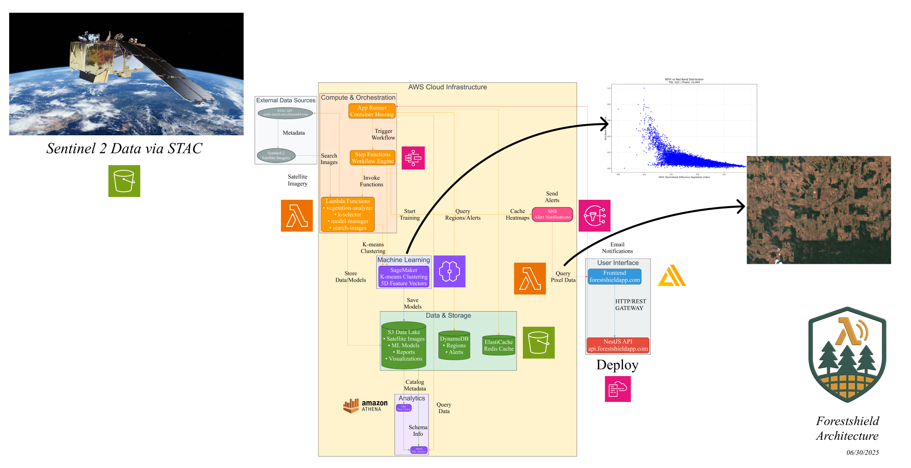
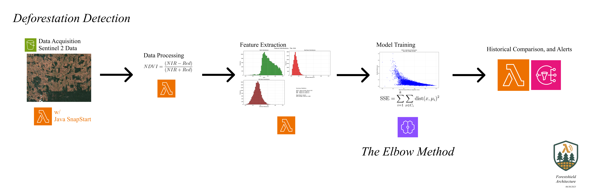
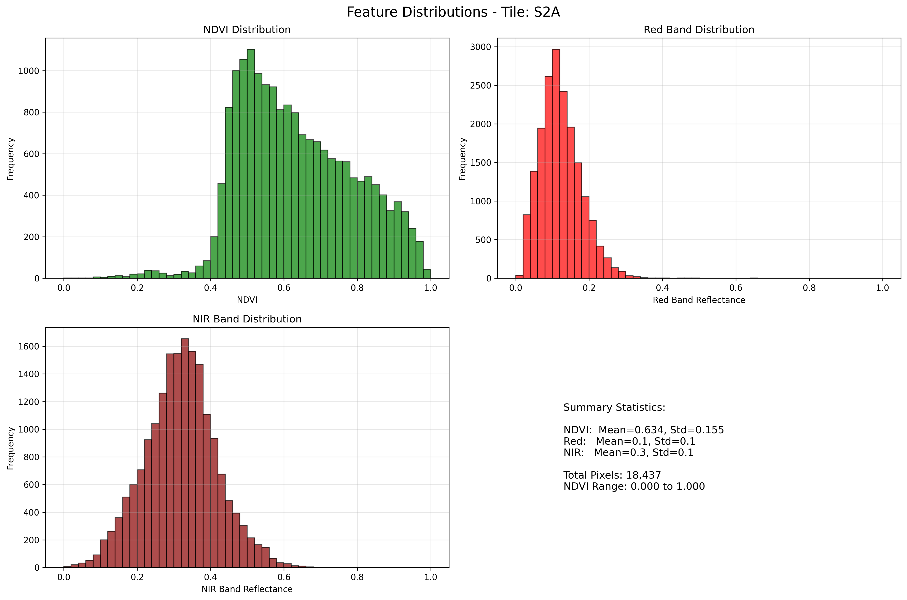

[](https://aws.amazon.com/)
[](https://aws.amazon.com/lambda/)
[](https://aws.amazon.com/s3/)
[](https://aws.amazon.com/dynamodb/)
[](https://aws.amazon.com/sagemaker/)
[](https://aws.amazon.com/step-functions/)
[](https://aws.amazon.com/apprunner/)
[](https://aws.amazon.com/cloudformation/)

[](https://aws.amazon.com/athena/)
[](https://aws.amazon.com/elasticache/)
[](https://aws.amazon.com/sns/)
[](https://aws.amazon.com/ecr/)
[](https://aws.amazon.com/glue/)
[](https://aws.amazon.com/iam/)
[](https://aws.amazon.com/vpc/)
[](https://aws.amazon.com/cloudwatch/)

[](https://nestjs.com/)
[](https://python.org/)
[](https://typescriptlang.org/)
[](https://openjdk.org/)
[](https://docker.com/)
[](https://redis.io/)

[](https://github.com/your-org/forestshield)
[](LICENSE)
[](https://serverless.com/)
[](https://scikit-learn.org/)

---

**Objective:**  
ForestShield aims to provide an automated, real-time, and scientifically robust platform for monitoring deforestation using satellite imagery and advanced machine learning. By leveraging cloud-native architecture and unsupervised learning, ForestShield delivers accurate, scalable, and actionable insights to help protect global forests.

---

## 🌲 ForestShield: Automated Deforestation Monitoring Platform



**ForestShield** is a fully serverless, cloud-native platform for automated monitoring and analysis of deforestation using Sentinel-2 satellite imagery. It leverages AWS managed services, machine learning (K-means clustering), and scalable event-driven architecture to provide real-time forest monitoring capabilities.

### 🔗 Quick Links

- **🌐 Live Application:** [https://forestshieldapp.com](https://forestshieldapp.com)
- **🚀 API Docs on Swagger UI:** [https://api.forestshieldapp.com](https://api.forestshieldapp.com/api/docs)
- **📂 Frontend GitHub Repository:** [https://github.com/youneslaaroussi/forestshield-frontend](https://github.com/youneslaaroussi/forestshield-frontend)

---

## 📦 Setup & Deployment

### Prerequisites

Before setting up ForestShield, ensure you have the following installed and configured:

#### **Required Software**
- **AWS CLI** (v2.x) - [Installation Guide](https://docs.aws.amazon.com/cli/latest/userguide/getting-started-install.html)
- **Docker** (v20.x+) - [Installation Guide](https://docs.docker.com/get-docker/)
- **Node.js** (v18.x+) - [Installation Guide](https://nodejs.org/)
- **Python** (v3.9+) - [Installation Guide](https://python.org/downloads/)
- **Java** (v11+) - [Installation Guide](https://openjdk.org/install/)
- **Maven** (v3.6+) - [Installation Guide](https://maven.apache.org/install.html)

#### **AWS Account Setup**
- **AWS Account** with appropriate permissions
- **AWS CLI configured** with credentials:
  ```bash
  aws configure
  # Enter your AWS Access Key ID, Secret Access Key, and default region
  ```
- **Docker authenticated with ECR**:
  ```bash
  aws ecr get-login-password --region us-west-2 | docker login --username AWS --password-stdin <account-id>.dkr.ecr.us-west-2.amazonaws.com
  ```

#### **Required AWS Permissions**
Your AWS user/role needs permissions for:
- CloudFormation (full access)
- Lambda, Step Functions, SageMaker
- S3, DynamoDB, Athena, Glue
- App Runner, ECR, ElastiCache
- IAM (for role creation)
- SNS, CloudWatch

### Installation Steps

#### **1. Clone the Repository**
```bash
git clone https://github.com/youneslaaroussi/forestshield-server.git
cd forestshield-server
```

#### **2. Configure Environment**
```bash
# Copy and edit the sample environment file
cp env.sample .env

# Edit .env with your AWS credentials and configuration
nano .env
```

#### **3. Deploy on AWS**
```bash
# Deploy on AWS (This Script will perform all required setup and uses CloudFormation)
./deploy.sh

# if on Windows Powershell and have WSL installed
bash deploy.sh
```

---

## 🧪 Usage Examples

### **Trigger Deforestation Analysis**
```bash
curl -X POST https://api.forestshieldapp.com/sentinel/step-functions/trigger \
-H "Content-Type: application/json" \
-d '{
  "searchParams": {
    "latitude": -6.0,
    "longitude": -53.0,
    "startDate": "2024-01-01",
    "endDate": "2024-01-15",
    "cloudCover": 20
  },
  "maxImages": 3
}'
```

View the Step Functions workflow live in your AWS Dashboard.

### **Get Heatmap Data**
```bash
curl "https://api.forestshieldapp.com/dashboard/heatmap?north=-5.9&south=-6.1&east=-52.9&west=-53.1&days=30"
```

### **Manage Alerts**
```bash
# Get recent alerts
curl "https://api.forestshieldapp.com/dashboard/alerts?limit=10"

# Get high-priority alerts
curl "https://api.forestshieldapp.com/dashboard/alerts?level=HIGH&acknowledged=false"
```

For complete API documentation see [DOCS.md](./DOCS.md).

---

## 🏗️ Architecture Overview


ForestShield represents a **state-of-the-art serverless architecture** that leverages the full power of AWS managed services to create an intelligent, scalable, and cost-effective deforestation monitoring system. The platform demonstrates advanced cloud-native design patterns and scientific computing at scale.



### 🎯 **Core Architectural Principles**

- **100% Serverless**: Zero server management, automatic scaling, pay-per-use pricing
- **Event-Driven**: Asynchronous processing with decoupled microservices
- **ML-First**: Machine learning integrated throughout the data pipeline
- **Real-Time**: Live monitoring with WebSocket connections and instant alerts
- **Multi-Region**: Geographically aware processing with region-specific ML models

### 🧠 **ML Pipeline**

The system implements sophisticated **unsupervised machine learning** using K-means clustering on scientifically-derived vegetation indices:

#### **NDVI Calculation**
```latex
NDVI = \frac{(NIR - Red)}{(NIR + Red)}
```
- **NIR**: Near-Infrared Band (Sentinel-2 B08, 842nm)
- **Red**: Red Band (Sentinel-2 B04, 665nm) 
- **Range**: -1.0 to +1.0 (vegetation typically > 0.2)

#### **5-Dimensional Feature Engineering**
Each pixel becomes a feature vector: `[NDVI, Red_Reflectance, NIR_Reflectance, Latitude, Longitude]`

#### **Automated K-Selection via Elbow Method**
```python
# Sum of Squared Errors optimization
SSE = Σ(k=1 to K) Σ(x∈Cluster_k) ||x - centroid_k||²
```



### ⚡ Lambda-Driven Architecture with SnapStart Optimization

At its core, ForestShield is powered by AWS Lambda — handling everything from STAC-based satellite image searches to NDVI computations and unsupervised ML.

Our Java-based image ingestion Lambda is accelerated using [**AWS Lambda SnapStart**](https://docs.aws.amazon.com/lambda/latest/dg/snapstart.html), cutting cold starts from 2s to ~200ms. This ensures we can **query, fetch, and process fresh Sentinel-2 imagery in seconds**.

Thanks to this architecture, ForestShield:
- Processes over **1M pixels/month** with **under $10 Lambda spend**
- Delivers **10x faster clustering** vs EC2-based approaches
- Instantly scales from zero to thousands of parallel detections

---

### 🏛️ **Step Functions Orchestration**

.png)

---

**🏆 This architecture demonstrates AWS best practices for:**
- Serverless-first design with event-driven processing
- ML/AI integration with scientific computing
- Real-time data processing and visualization  
- Cost-optimized scalable infrastructure
- Enterprise security and compliance patterns

---

## 🧹 Cleanup

To remove all AWS resources and avoid ongoing charges:

```bash
./deploy/cleanup.sh
```

**⚠️ Warning:** This will permanently delete all data, models, and infrastructure.

---

## 📖 Documentation

- **📋 Complete Technical Specification:** [DOCS.md](./DOCS.md)
- **🏗️ Infrastructure Details:** [cloudformation.yaml](./cloudformation.yaml)
- **🚀 Deployment Scripts:** [deploy/](./deploy/)

---

## 🤝 Contributing

1. Fork the repository
2. Create your feature branch (`git checkout -b feature/amazing-feature`)
3. Commit your changes (`git commit -m 'Add amazing feature'`)
4. Push to the branch (`git push origin feature/amazing-feature`)
5. Open a Pull Request

---

## 📄 License

This project is licensed under the MIT License - see the [LICENSE](LICENSE) file for details.

---

## 🙏 Acknowledgments

- **ESA Sentinel-2** for satellite imagery
- **AWS** for cloud infrastructure
- **Open source community** for tools and libraries

---

## Citations

Methods applied based on research:

- [Detecting deforestation in the Amazon rainforest using unsupervised K-means clustering on satellite imagery](./https://developers.arcgis.com/python/latest/samples/detecting-deforestation-using-kmeans-clustering-on-sentinel-imagery/)
- [Md Jelas I, Zulkifley MA, Abdullah M and Spraggon M (2024) Deforestation detection using deep learning-based semantic segmentation techniques: a systematic review. Front. For. Glob. Change 7:1300060. doi: 10.3389/ffgc.2024.1300060](./https://www.frontiersin.org/journals/forests-and-global-change/articles/10.3389/ffgc.2024.1300060/full)
- [aws-smsl-geospatial-analysis-deforestation](https://github.com/aws-samples/aws-smsl-geospatial-analysis-deforestation/)

---
